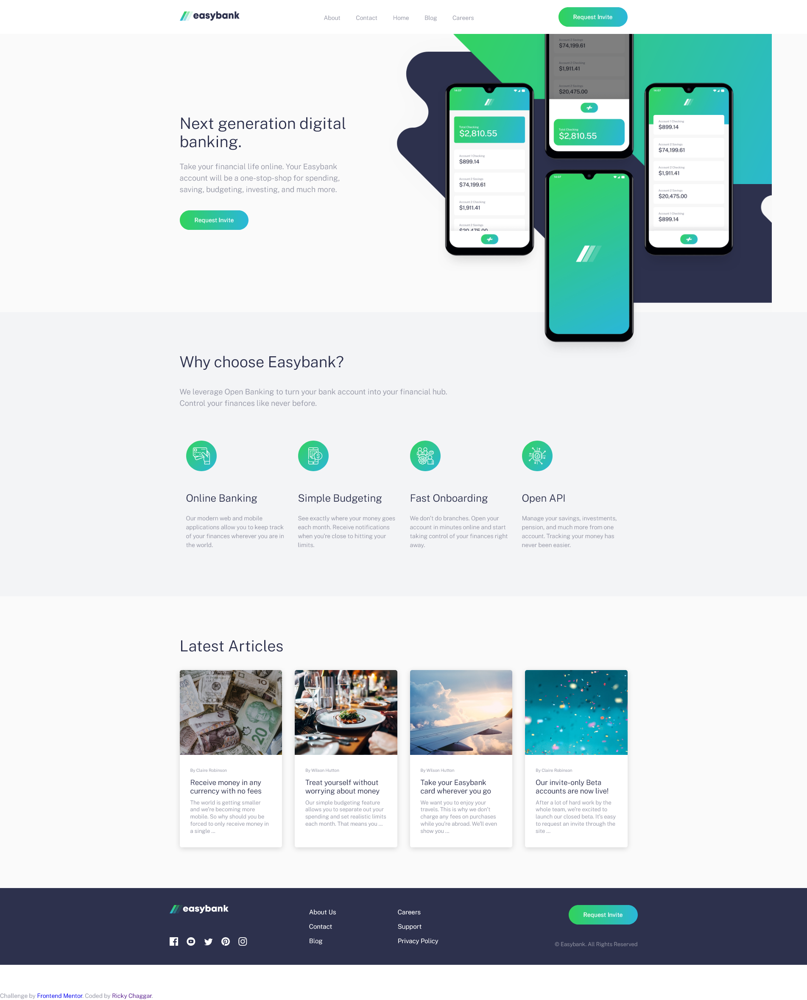

# Frontend Mentor - Easybank landing page solution

This is a solution to the [Easybank landing page challenge on Frontend Mentor](https://www.frontendmentor.io/challenges/easybank-landing-page-WaUhkoDN). Frontend Mentor challenges help you improve your coding skills by building realistic projects. 

## Table of contents

- [Overview](#overview)
  - [The challenge](#the-challenge)
  - [Screenshot](#screenshot)
  - [Links](#links)
- [My process](#my-process)
  - [Built with](#built-with)
  - [What I learned](#what-i-learned)
  - [Continued development](#continued-development)
  - [Useful resources](#useful-resources)
- [Author](#author)
- [Acknowledgments](#acknowledgments)

**Note: Delete this note and update the table of contents based on what sections you keep.**

## Overview

### The challenge

Users should be able to:

- View the optimal layout for the site depending on their device's screen size
- See hover states for all interactive elements on the page

### Screenshot

### Links

- Solution URL: [Github Repo](https://github.com/Ricksoc/easybankLandingPage)
- Live Site URL: [Github Pages Hosting](https://ricksoc.github.io/easybankLandingPage/)

## My process

This was a learning project and my first experience of using SASS. I did use help from youtube
videos and static websites.

### Built with

- Semantic HTML5 markup
- SCSS
- Flexbox
- CSS Grid
- Mobile-first workflow

### What I learned

- Use of svgs in html and associated CSS styles
- SCSS + good workflow and class naming conventions
- Keyframe animation
- Grid template areas
- ::before and :: after pseudo elements
- Mixins and map-get

### Continued development

Use this section to outline areas that you want to continue focusing on in future projects. These could be concepts you're still not completely comfortable with or techniques you found useful that you want to refine and perfect.

**Note: Delete this note and the content within this section and replace with your own plans for continued development.**

### Useful resources

- [Jessica Chan of codercoder](https://www.youtube.com/watch?v=aoQ6S1a32j8) - I relied on this a lot to get started before doing more on my own later, though still referring back when I got too stuck. I will continue to use her SCSS workflow.
